# masterpiece-palettes

**Scientific figure color palettes extracted from 102 masterpiece paintings.**

Every palette is machine-extracted from a public-domain masterpiece (K-means in CIELab),
refined for publication use (chroma boost, lightness spacing, guaranteed ΔE separation
between categorical colors), and assigned scientific roles: warm primaries carry your
main signal, cool secondaries carry structure, an accent highlights thresholds, light
neutrals form backgrounds, dark neutrals draw text and axes.

Each painting ships with a poster showing the palette applied to nine common figure
types — heatmap, clustered scatter, violin, spectral fit, dual-axis, polar, 3D surface,
time series, grouped bar — so you can judge at a glance how it behaves on real charts.


## Install

```bash
pip install "git+https://github.com/stevenZYzhao/masterpiece-palettes.git"
```

## Quick start

```python
import masterpalettes as mp
import matplotlib.pyplot as plt

mp.list_palettes()                    # 102 names
mp.colors("starry_night")            # 8 hex colors in data-plotting order
mp.roles("starry_night")             # role -> colors (primary/secondary/accent/...)

# Use as the default color cycle
mp.apply("great_wave")
plt.plot(x, y1); plt.plot(x, y2)     # lines take Hokusai's blues automatically

# Diverging colormap for heatmaps / surfaces
plt.imshow(corr, cmap=mp.cmap("starry_night"), vmin=-1, vmax=1)

# Or register everything and refer to cmaps by name
mp.register_matplotlib()
plt.imshow(corr, cmap="mp.the_scream")

# seaborn
import seaborn as sns
sns.set_palette(mp.colors("water_lilies", 6))
```

Every palette is also a plain JSON record in
[`masterpalettes/data/palettes.json`](masterpalettes/data/palettes.json) —
usable from R, Julia, MATLAB, or by copy-pasting hex codes.

## How palettes are made

1. **Extract** — K-means (k=14) over the painting in CIELab; merge near-duplicates.
2. **Refine** — adaptive: oil paintings get a chroma boost and lightness clamping;
   ink/silk works keep their restrained "muted mode" aesthetic. The first six colors
   are seated with guaranteed perceptual spacing (ΔE ≥ ~10).
3. **Assign roles** — fixed logic across the collection: warm high-chroma pair =
   primary data; cool pair = secondary; accent = warmest color pushed toward
   red-orange; lightest = backgrounds; darkest = text/lines. Diverging maps run
   cool-dark → paper-light → warm-accent.
4. **Review** — every palette and poster passed an AI review pass (color naming,
   metadata fact-check, visual QA) plus human curation.

Full pipeline in [`engine/`](engine/), design notes in [`docs/DESIGN.md`](docs/DESIGN.md).

## Gallery

*Click any thumbnail for the full poster with hex codes and usage guide.*


### Renaissance & Baroque (24)

<table>
<tr>
<td align="center" width="25%"><a href="posters/mona_lisa.jpg">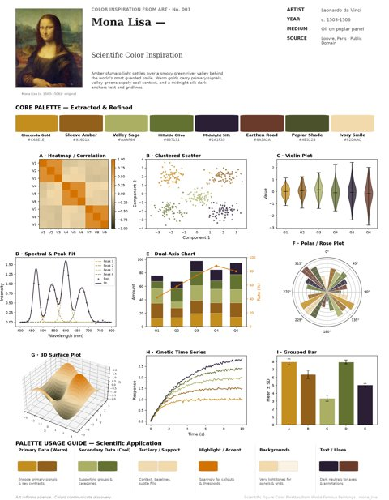</a><br><sub><b>Mona Lisa</b><br>Leonardo da Vinci, c. 1503-1506</sub></td>
<td align="center" width="25%"><a href="posters/last_supper.jpg">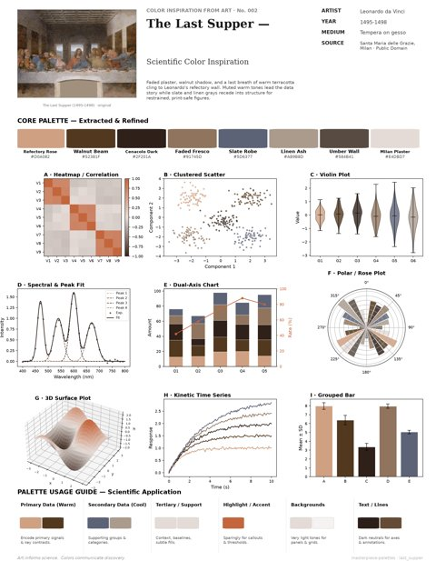</a><br><sub><b>The Last Supper</b><br>Leonardo da Vinci, 1495-1498</sub></td>
<td align="center" width="25%"><a href="posters/birth_of_venus.jpg">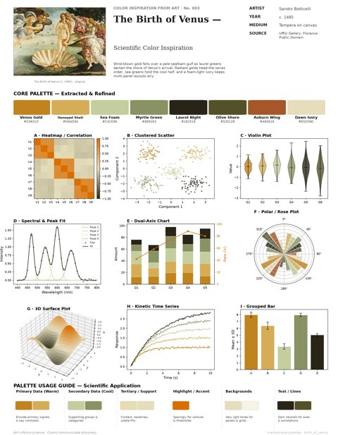</a><br><sub><b>The Birth of Venus</b><br>Sandro Botticelli, c. 1485</sub></td>
<td align="center" width="25%"><a href="posters/primavera.jpg">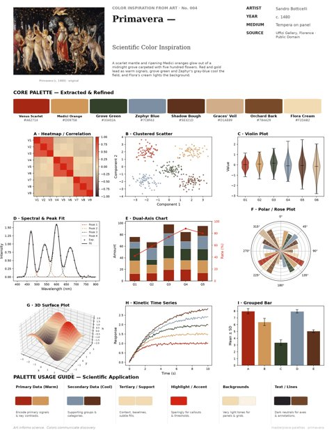</a><br><sub><b>Primavera</b><br>Sandro Botticelli, c. 1480</sub></td>
</tr>
<tr>
<td align="center" width="25%"><a href="posters/creation_of_adam.jpg">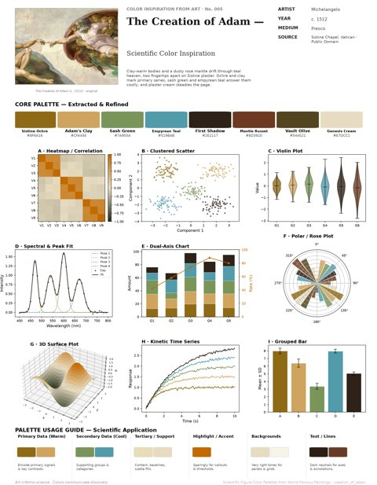</a><br><sub><b>The Creation of Adam</b><br>Michelangelo, c. 1512</sub></td>
<td align="center" width="25%"><a href="posters/school_of_athens.jpg">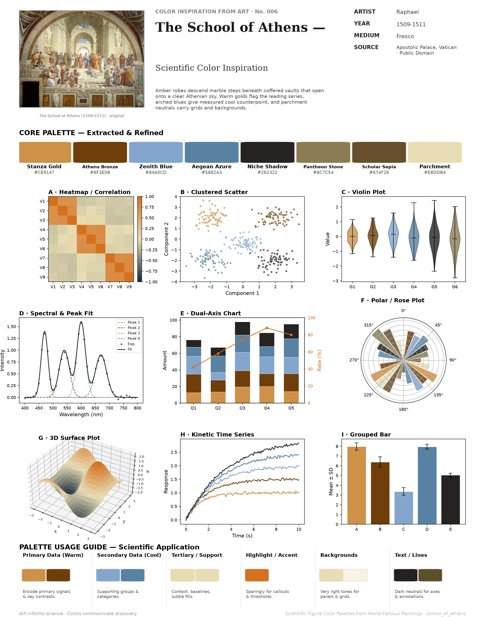</a><br><sub><b>The School of Athens</b><br>Raphael, 1509-1511</sub></td>
<td align="center" width="25%"><a href="posters/sistine_madonna.jpg">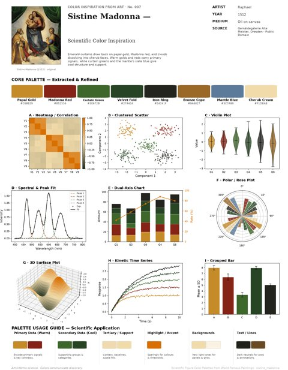</a><br><sub><b>Sistine Madonna</b><br>Raphael, 1512</sub></td>
<td align="center" width="25%"><a href="posters/venus_of_urbino.jpg">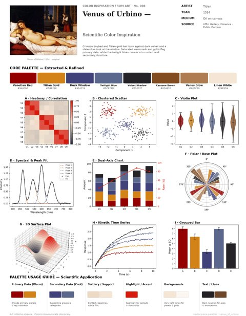</a><br><sub><b>Venus of Urbino</b><br>Titian, 1534</sub></td>
</tr>
<tr>
<td align="center" width="25%"><a href="posters/bacchus_and_ariadne.jpg">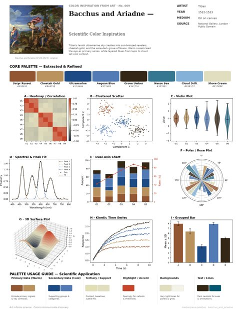</a><br><sub><b>Bacchus and Ariadne</b><br>Titian, 1522-1523</sub></td>
<td align="center" width="25%"><a href="posters/arnolfini_portrait.jpg">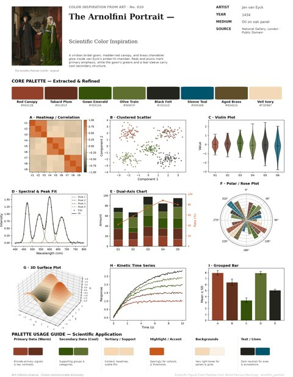</a><br><sub><b>The Arnolfini Portrait</b><br>Jan van Eyck, 1434</sub></td>
<td align="center" width="25%"><a href="posters/garden_of_earthly_delights.jpg">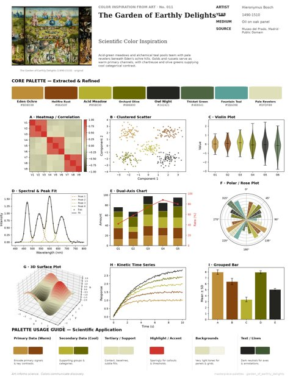</a><br><sub><b>The Garden of Earthly Delights</b><br>Hieronymus Bosch, 1490-1510</sub></td>
<td align="center" width="25%"><a href="posters/hunters_in_the_snow.jpg">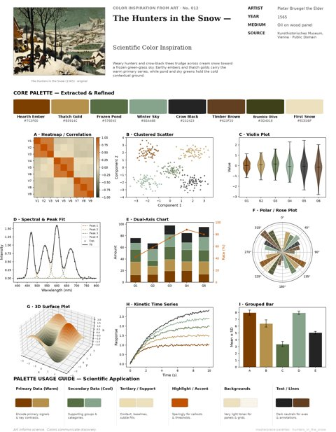</a><br><sub><b>The Hunters in the Snow</b><br>Pieter Bruegel the Elder, 1565</sub></td>
</tr>
<tr>
<td align="center" width="25%"><a href="posters/tower_of_babel.jpg">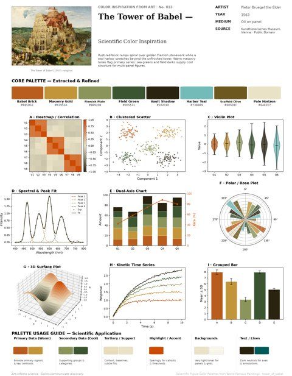</a><br><sub><b>The Tower of Babel</b><br>Pieter Bruegel the Elder, 1563</sub></td>
<td align="center" width="25%"><a href="posters/the_ambassadors.jpg">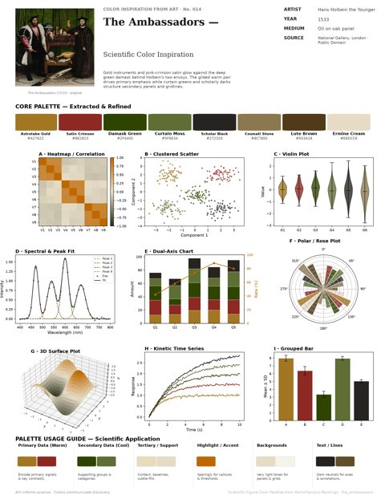</a><br><sub><b>The Ambassadors</b><br>Hans Holbein the Younger, 1533</sub></td>
<td align="center" width="25%"><a href="posters/young_hare.jpg">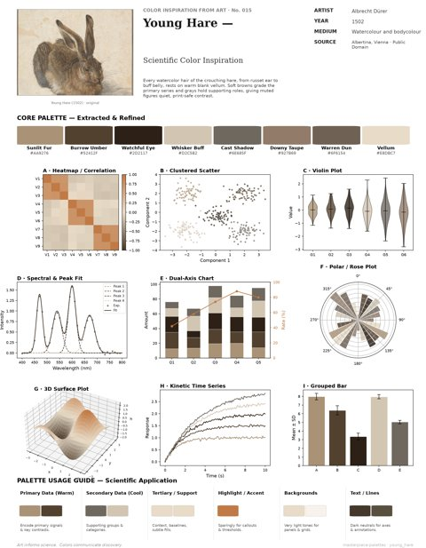</a><br><sub><b>Young Hare</b><br>Albrecht Durer, 1502</sub></td>
<td align="center" width="25%"><a href="posters/vertumnus.jpg">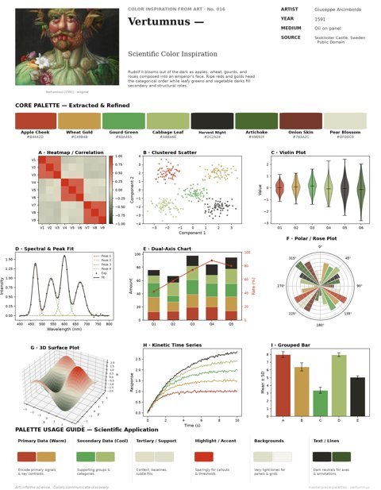</a><br><sub><b>Vertumnus</b><br>Giuseppe Arcimboldo, 1591</sub></td>
</tr>
<tr>
<td align="center" width="25%"><a href="posters/view_of_toledo.jpg">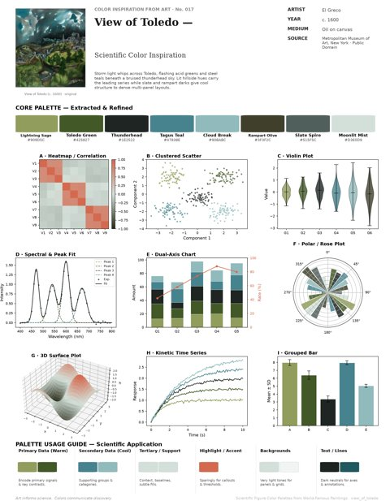</a><br><sub><b>View of Toledo</b><br>El Greco, c. 1600</sub></td>
<td align="center" width="25%"><a href="posters/las_meninas.jpg">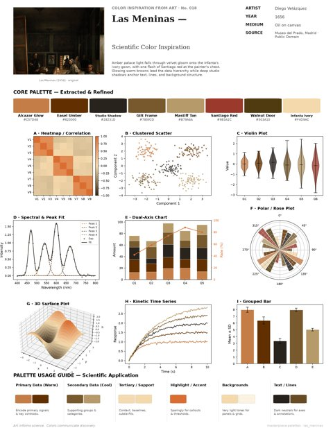</a><br><sub><b>Las Meninas</b><br>Diego Velazquez, 1656</sub></td>
<td align="center" width="25%"><a href="posters/calling_of_saint_matthew.jpg">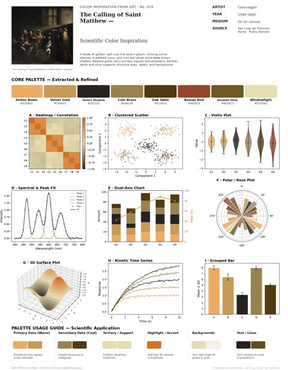</a><br><sub><b>The Calling of Saint Matthew</b><br>Caravaggio, 1599-1600</sub></td>
<td align="center" width="25%"><a href="posters/night_watch.jpg">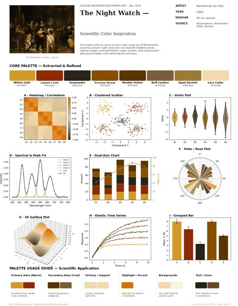</a><br><sub><b>The Night Watch</b><br>Rembrandt van Rijn, 1642</sub></td>
</tr>
<tr>
<td align="center" width="25%"><a href="posters/girl_with_a_pearl_earring.jpg">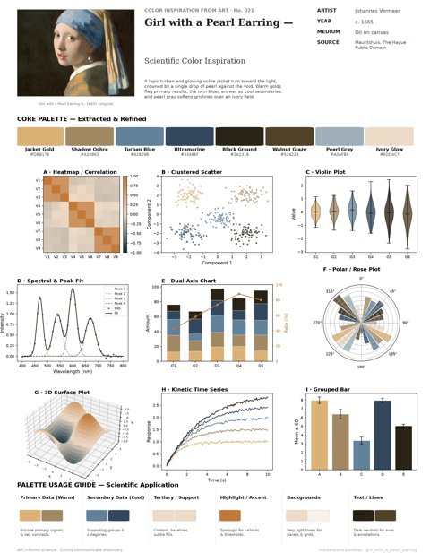</a><br><sub><b>Girl with a Pearl Earring</b><br>Johannes Vermeer, c. 1665</sub></td>
<td align="center" width="25%"><a href="posters/the_milkmaid.jpg">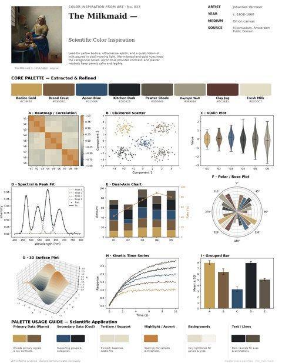</a><br><sub><b>The Milkmaid</b><br>Johannes Vermeer, c. 1658-1660</sub></td>
<td align="center" width="25%"><a href="posters/the_blue_boy.jpg">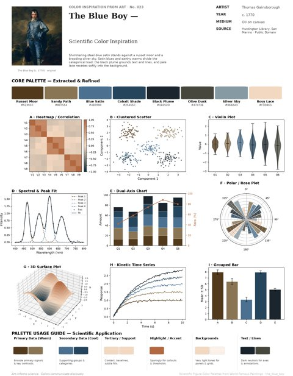</a><br><sub><b>The Blue Boy</b><br>Thomas Gainsborough, c. 1770</sub></td>
<td align="center" width="25%"><a href="posters/the_swing.jpg">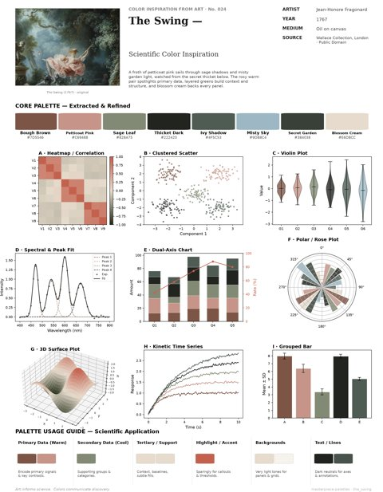</a><br><sub><b>The Swing</b><br>Jean-Honore Fragonard, 1767</sub></td>
</tr>
</table>


### Romanticism & Realism (22)

<table>
<tr>
<td align="center" width="25%"><a href="posters/napoleon_crossing_the_alps.jpg">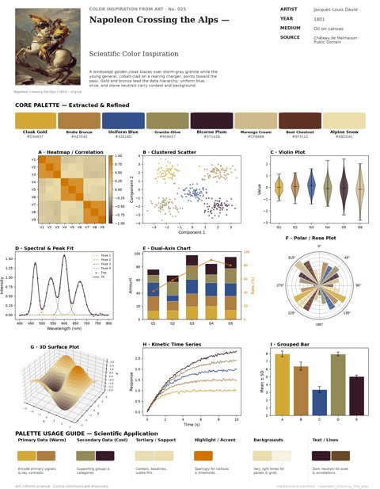</a><br><sub><b>Napoleon Crossing the Alps</b><br>Jacques-Louis David, 1801</sub></td>
<td align="center" width="25%"><a href="posters/oath_of_the_horatii.jpg">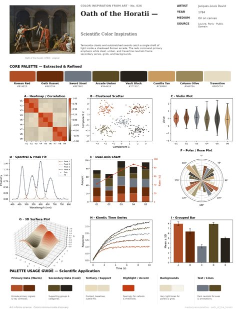</a><br><sub><b>Oath of the Horatii</b><br>Jacques-Louis David, 1784</sub></td>
<td align="center" width="25%"><a href="posters/grande_odalisque.jpg">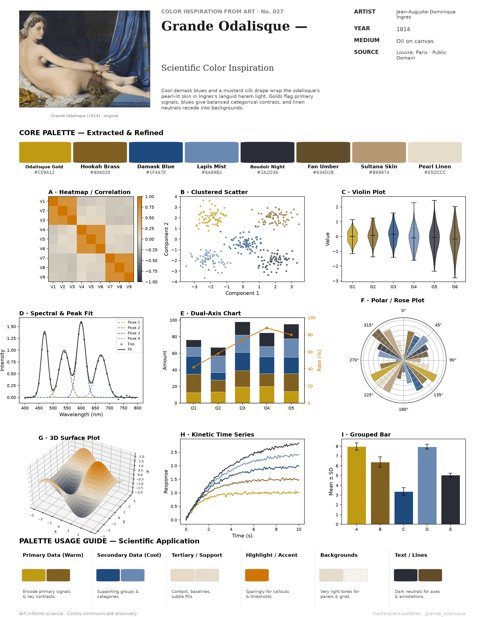</a><br><sub><b>Grande Odalisque</b><br>Jean-Auguste-Dominique Ingres, 1814</sub></td>
<td align="center" width="25%"><a href="posters/liberty_leading_the_people.jpg">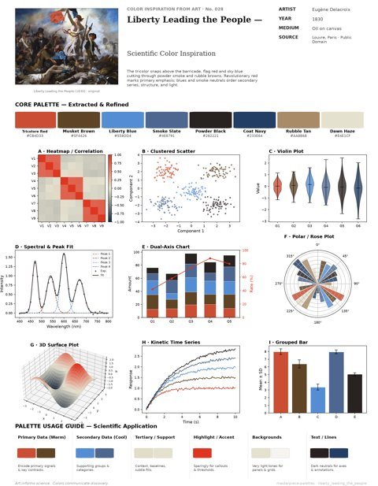</a><br><sub><b>Liberty Leading the People</b><br>Eugene Delacroix, 1830</sub></td>
</tr>
<tr>
<td align="center" width="25%"><a href="posters/raft_of_the_medusa.jpg">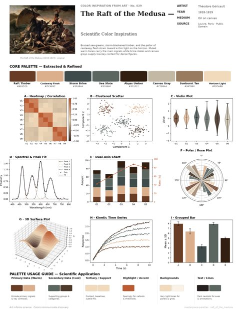</a><br><sub><b>The Raft of the Medusa</b><br>Theodore Gericault, 1818-1819</sub></td>
<td align="center" width="25%"><a href="posters/third_of_may_1808.jpg">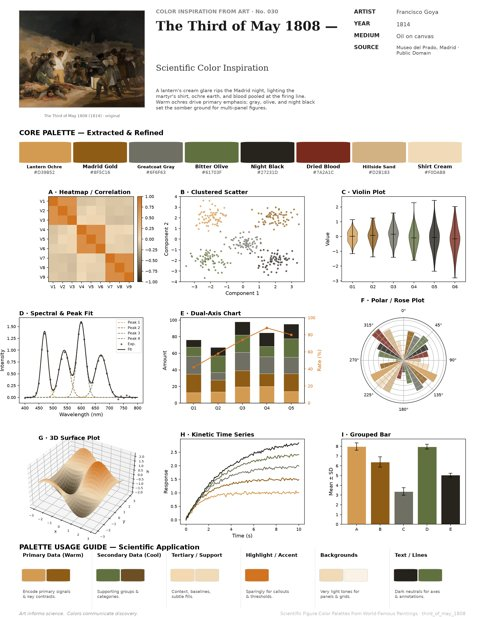</a><br><sub><b>The Third of May 1808</b><br>Francisco Goya, 1814</sub></td>
<td align="center" width="25%"><a href="posters/the_parasol.jpg">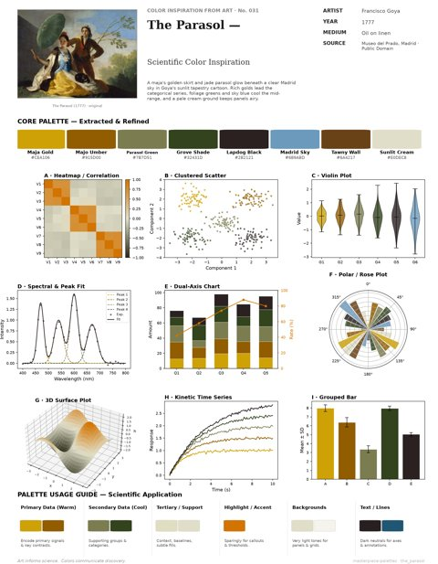</a><br><sub><b>The Parasol</b><br>Francisco Goya, 1777</sub></td>
<td align="center" width="25%"><a href="posters/wanderer_above_the_sea_of_fog.jpg">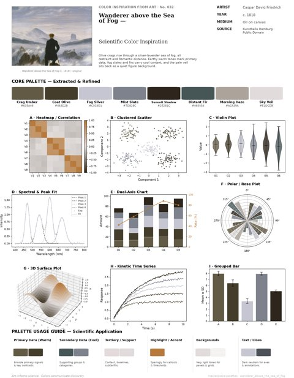</a><br><sub><b>Wanderer above the Sea of Fog</b><br>Caspar David Friedrich, c. 1818</sub></td>
</tr>
<tr>
<td align="center" width="25%"><a href="posters/fighting_temeraire.jpg">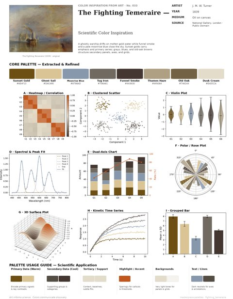</a><br><sub><b>The Fighting Temeraire</b><br>J. M. W. Turner, 1839</sub></td>
<td align="center" width="25%"><a href="posters/rain_steam_and_speed.jpg">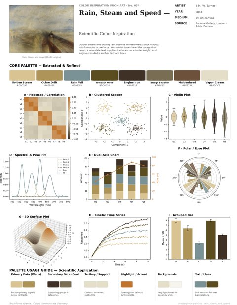</a><br><sub><b>Rain, Steam and Speed</b><br>J. M. W. Turner, 1844</sub></td>
<td align="center" width="25%"><a href="posters/the_hay_wain.jpg">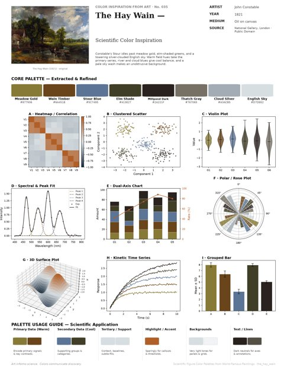</a><br><sub><b>The Hay Wain</b><br>John Constable, 1821</sub></td>
<td align="center" width="25%"><a href="posters/the_gleaners.jpg">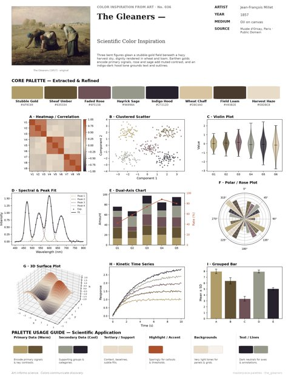</a><br><sub><b>The Gleaners</b><br>Jean-Francois Millet, 1857</sub></td>
</tr>
<tr>
<td align="center" width="25%"><a href="posters/ophelia.jpg">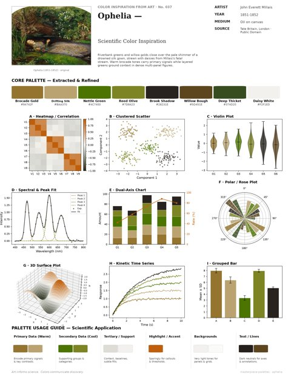</a><br><sub><b>Ophelia</b><br>John Everett Millais, 1851-1852</sub></td>
<td align="center" width="25%"><a href="posters/lady_of_shalott.jpg">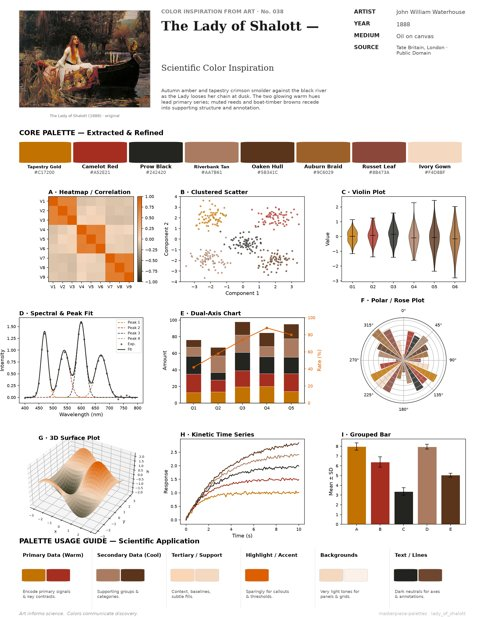</a><br><sub><b>The Lady of Shalott</b><br>John William Waterhouse, 1888</sub></td>
<td align="center" width="25%"><a href="posters/flaming_june.jpg">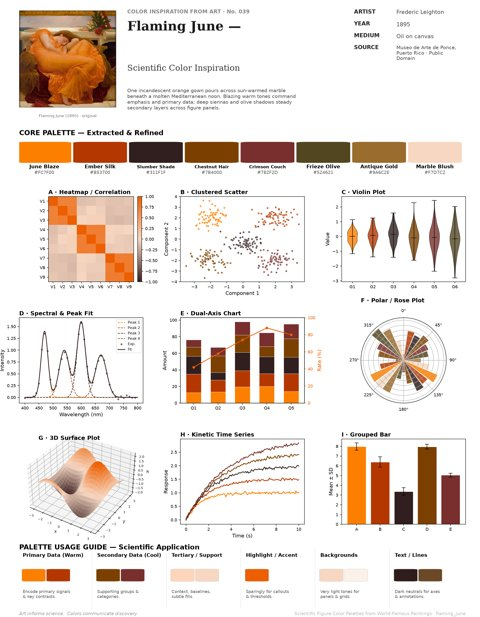</a><br><sub><b>Flaming June</b><br>Frederic Leighton, 1895</sub></td>
<td align="center" width="25%"><a href="posters/the_kiss_hayez.jpg">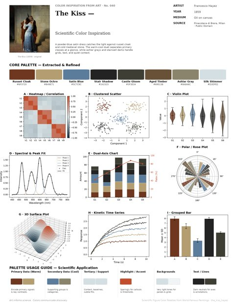</a><br><sub><b>The Kiss</b><br>Francesco Hayez, 1859</sub></td>
</tr>
<tr>
<td align="center" width="25%"><a href="posters/whistlers_mother.jpg">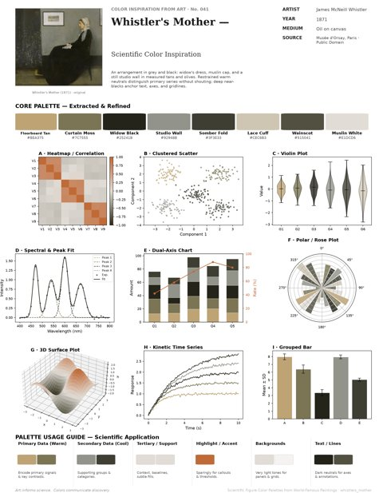</a><br><sub><b>Whistler's Mother</b><br>James McNeill Whistler, 1871</sub></td>
<td align="center" width="25%"><a href="posters/carnation_lily_lily_rose.jpg">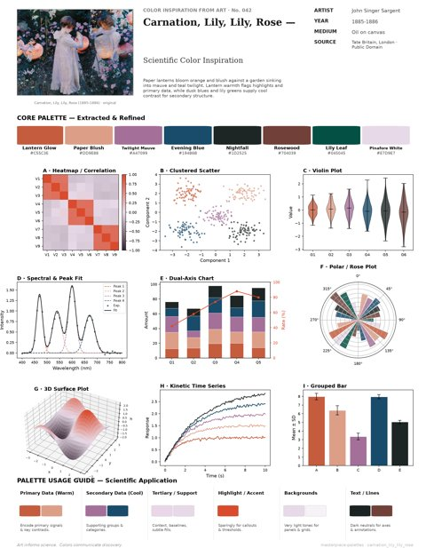</a><br><sub><b>Carnation, Lily, Lily, Rose</b><br>John Singer Sargent, 1885-1886</sub></td>
<td align="center" width="25%"><a href="posters/the_ninth_wave.jpg">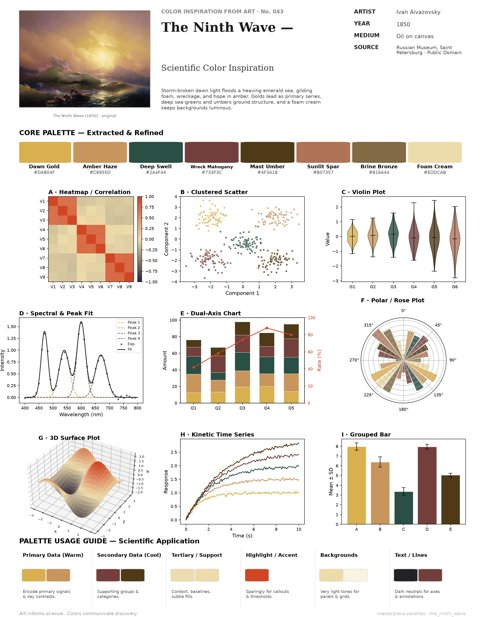</a><br><sub><b>The Ninth Wave</b><br>Ivan Aivazovsky, 1850</sub></td>
<td align="center" width="25%"><a href="posters/barge_haulers_on_the_volga.jpg">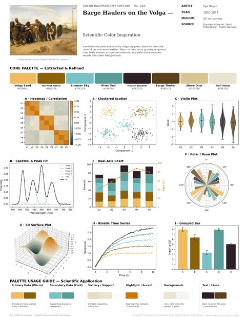</a><br><sub><b>Barge Haulers on the Volga</b><br>Ilya Repin, 1870-1873</sub></td>
</tr>
<tr>
<td align="center" width="25%"><a href="posters/morning_in_a_pine_forest.jpg">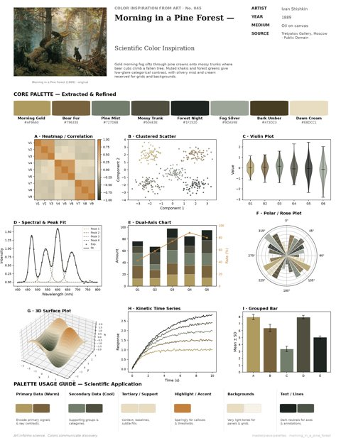</a><br><sub><b>Morning in a Pine Forest</b><br>Ivan Shishkin, 1889</sub></td>
<td align="center" width="25%"><a href="posters/breezing_up.jpg">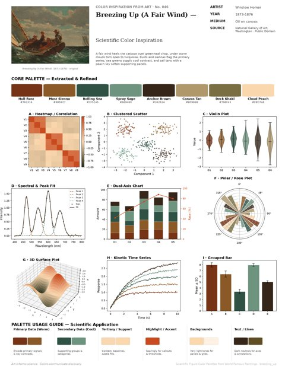</a><br><sub><b>Breezing Up (A Fair Wind)</b><br>Winslow Homer, 1873-1876</sub></td>
</tr>
</table>


### Impressionism (13)

<table>
<tr>
<td align="center" width="25%"><a href="posters/impression_sunrise.jpg">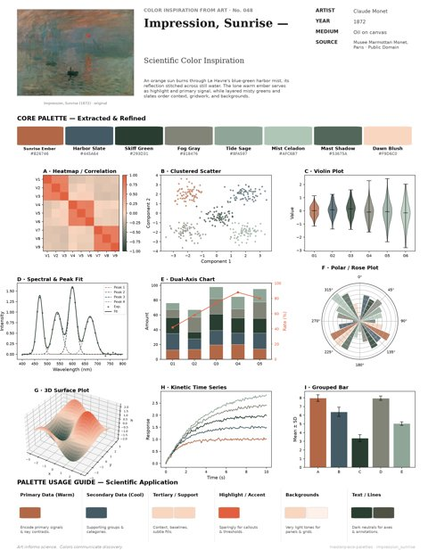</a><br><sub><b>Impression, Sunrise</b><br>Claude Monet, 1872</sub></td>
<td align="center" width="25%"><a href="posters/woman_with_a_parasol.jpg">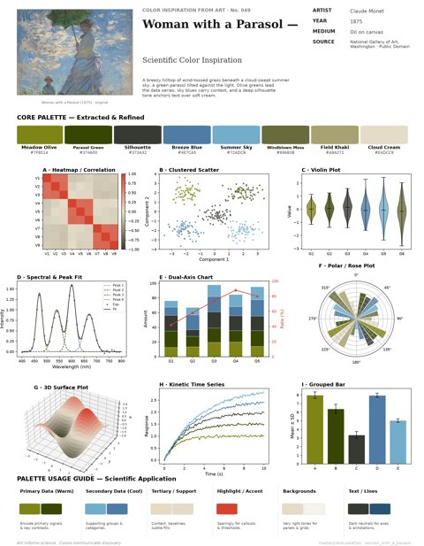</a><br><sub><b>Woman with a Parasol</b><br>Claude Monet, 1875</sub></td>
<td align="center" width="25%"><a href="posters/water_lilies.jpg">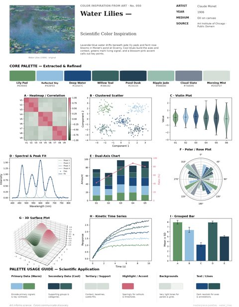</a><br><sub><b>Water Lilies</b><br>Claude Monet, 1906</sub></td>
<td align="center" width="25%"><a href="posters/japanese_footbridge.jpg">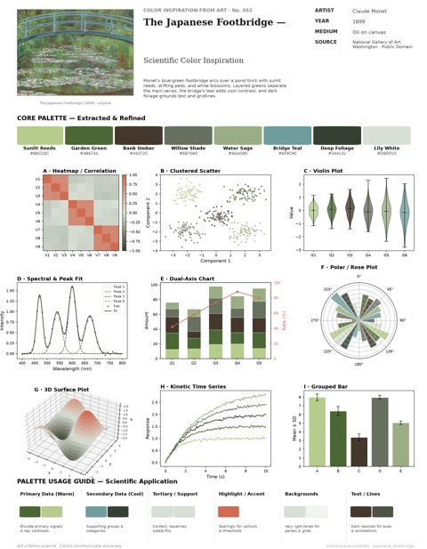</a><br><sub><b>The Japanese Footbridge</b><br>Claude Monet, 1899</sub></td>
</tr>
<tr>
<td align="center" width="25%"><a href="posters/luncheon_of_the_boating_party.jpg">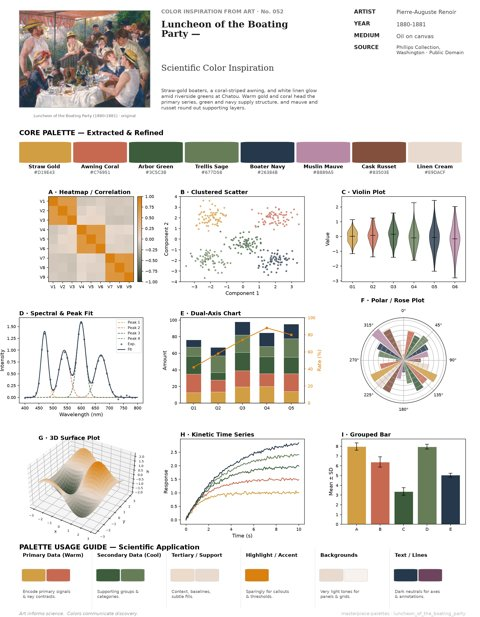</a><br><sub><b>Luncheon of the Boating Party</b><br>Pierre-Auguste Renoir, 1880-1881</sub></td>
<td align="center" width="25%"><a href="posters/bal_du_moulin_de_la_galette.jpg">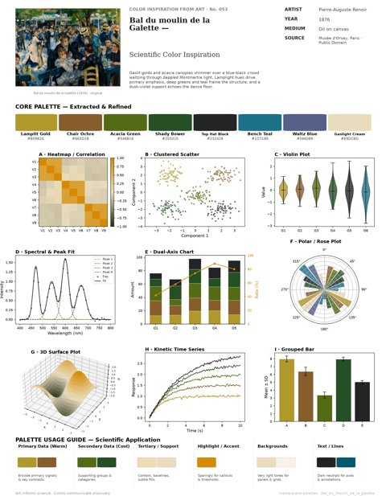</a><br><sub><b>Bal du moulin de la Galette</b><br>Pierre-Auguste Renoir, 1876</sub></td>
<td align="center" width="25%"><a href="posters/two_sisters_on_the_terrace.jpg">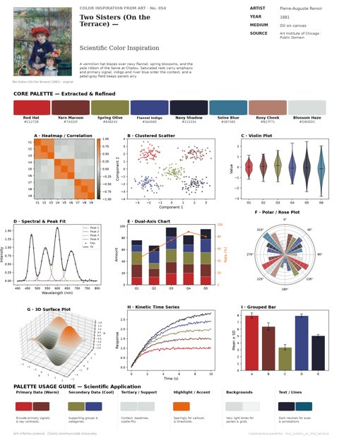</a><br><sub><b>Two Sisters (On the Terrace)</b><br>Pierre-Auguste Renoir, 1881</sub></td>
<td align="center" width="25%"><a href="posters/the_ballet_class.jpg">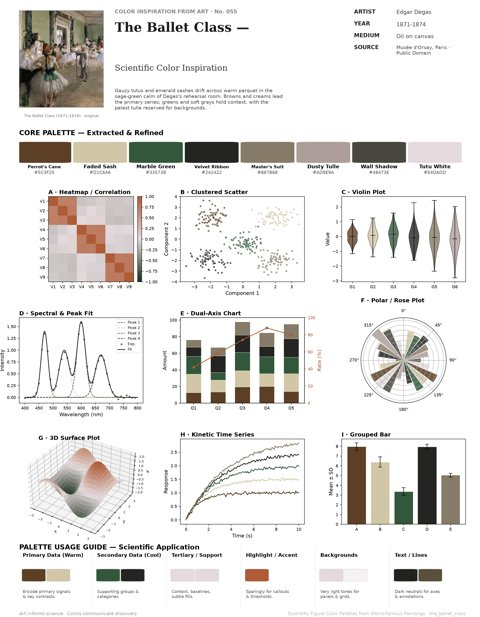</a><br><sub><b>The Ballet Class</b><br>Edgar Degas, 1871-1874</sub></td>
</tr>
<tr>
<td align="center" width="25%"><a href="posters/paris_street_rainy_day.jpg">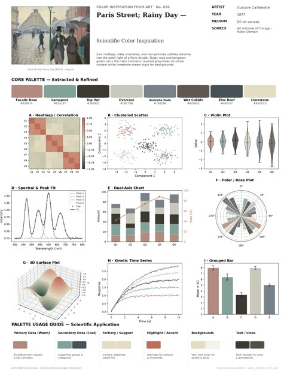</a><br><sub><b>Paris Street; Rainy Day</b><br>Gustave Caillebotte, 1877</sub></td>
<td align="center" width="25%"><a href="posters/boulevard_montmartre_at_night.jpg">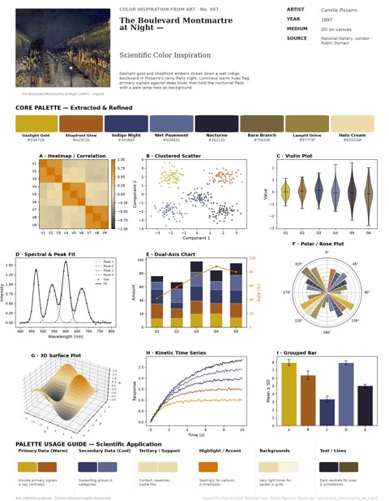</a><br><sub><b>The Boulevard Montmartre at Night</b><br>Camille Pissarro, 1897</sub></td>
<td align="center" width="25%"><a href="posters/the_childs_bath.jpg">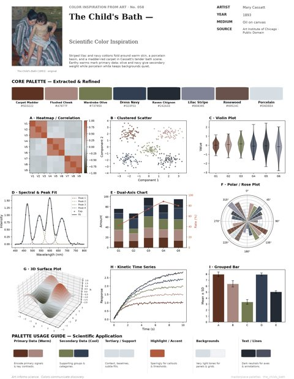</a><br><sub><b>The Child's Bath</b><br>Mary Cassatt, 1893</sub></td>
<td align="center" width="25%"><a href="posters/a_sunday_on_la_grande_jatte.jpg">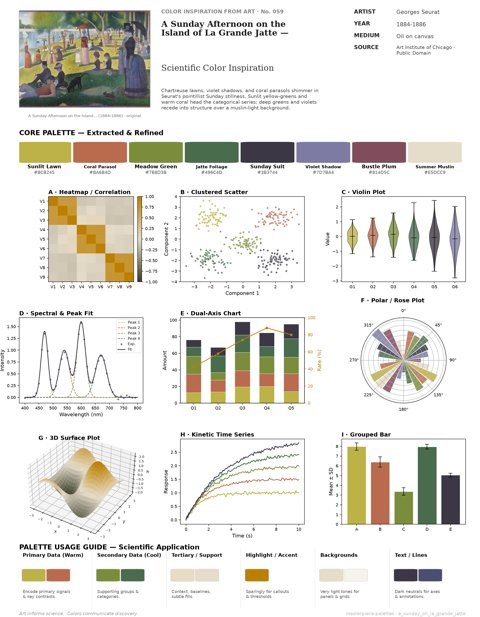</a><br><sub><b>A Sunday Afternoon on the Island of La Grande Jatte</b><br>Georges Seurat, 1884-1886</sub></td>
</tr>
<tr>
<td align="center" width="25%"><a href="posters/bathers_at_asnieres.jpg">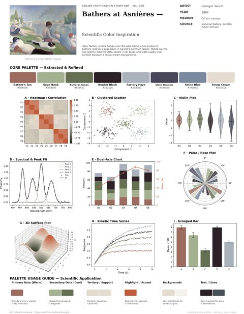</a><br><sub><b>Bathers at Asnieres</b><br>Georges Seurat, 1884</sub></td>
</tr>
</table>


### Post-Impressionism (11)

<table>
<tr>
<td align="center" width="25%"><a href="posters/starry_night.jpg">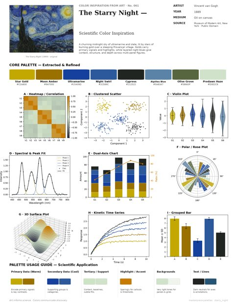</a><br><sub><b>The Starry Night</b><br>Vincent van Gogh, 1889</sub></td>
<td align="center" width="25%"><a href="posters/sunflowers.jpg">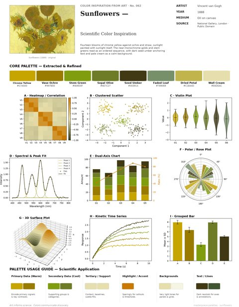</a><br><sub><b>Sunflowers</b><br>Vincent van Gogh, 1888</sub></td>
<td align="center" width="25%"><a href="posters/cafe_terrace_at_night.jpg">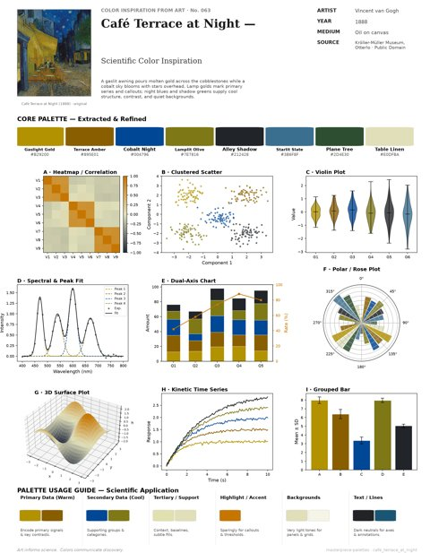</a><br><sub><b>Cafe Terrace at Night</b><br>Vincent van Gogh, 1888</sub></td>
<td align="center" width="25%"><a href="posters/irises.jpg">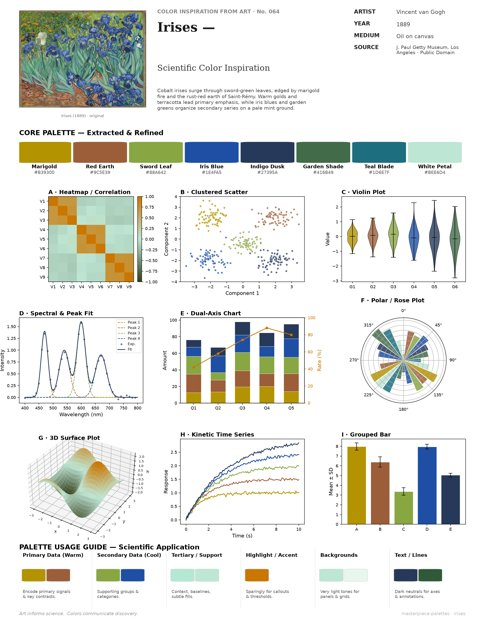</a><br><sub><b>Irises</b><br>Vincent van Gogh, 1889</sub></td>
</tr>
<tr>
<td align="center" width="25%"><a href="posters/the_bedroom.jpg">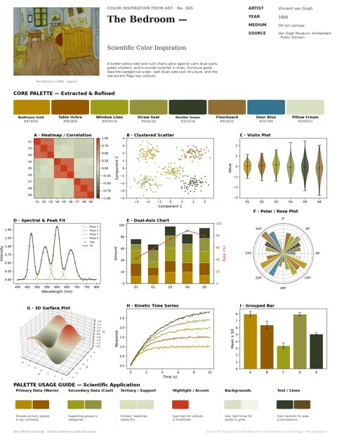</a><br><sub><b>The Bedroom</b><br>Vincent van Gogh, 1888</sub></td>
<td align="center" width="25%"><a href="posters/tahitian_women_on_the_beach.jpg">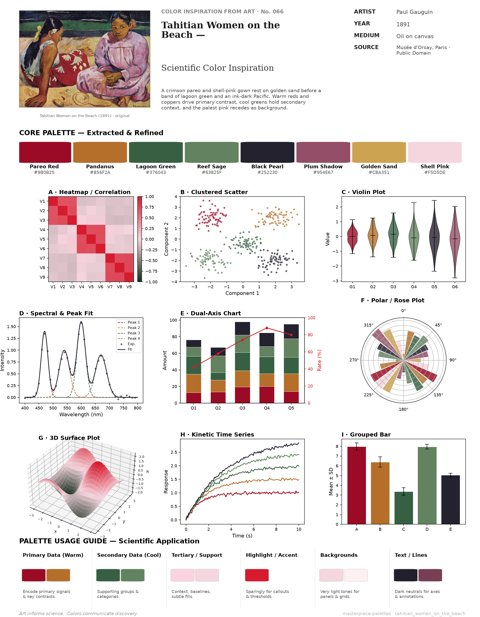</a><br><sub><b>Tahitian Women on the Beach</b><br>Paul Gauguin, 1891</sub></td>
<td align="center" width="25%"><a href="posters/the_card_players.jpg">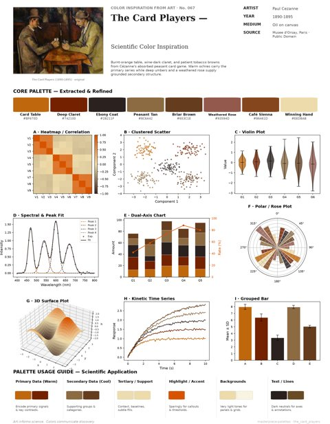</a><br><sub><b>The Card Players</b><br>Paul Cezanne, 1890-1895</sub></td>
<td align="center" width="25%"><a href="posters/mont_sainte_victoire.jpg">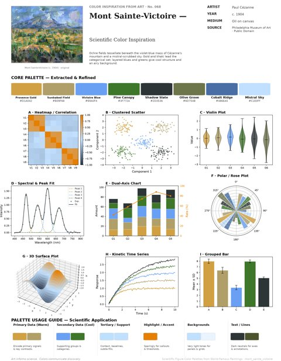</a><br><sub><b>Mont Sainte-Victoire</b><br>Paul Cezanne, c. 1904</sub></td>
</tr>
<tr>
<td align="center" width="25%"><a href="posters/the_basket_of_apples.jpg">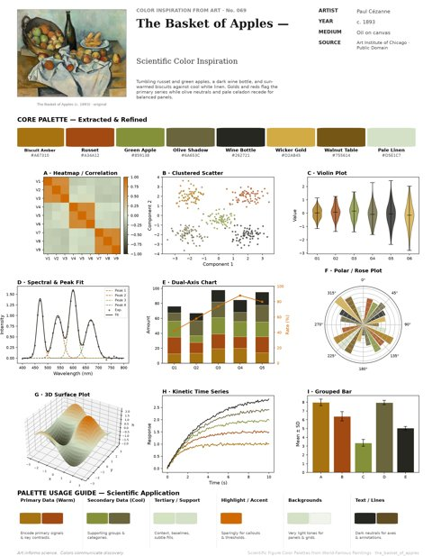</a><br><sub><b>The Basket of Apples</b><br>Paul Cezanne, c. 1893</sub></td>
<td align="center" width="25%"><a href="posters/at_the_moulin_rouge.jpg">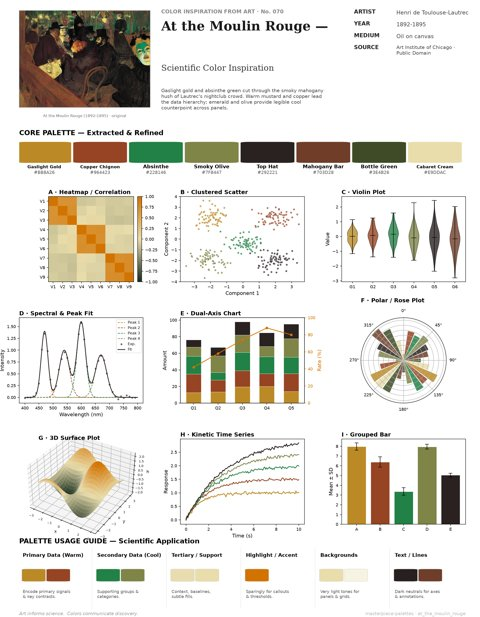</a><br><sub><b>At the Moulin Rouge</b><br>Henri de Toulouse-Lautrec, 1892-1895</sub></td>
<td align="center" width="25%"><a href="posters/the_sleeping_gypsy.jpg">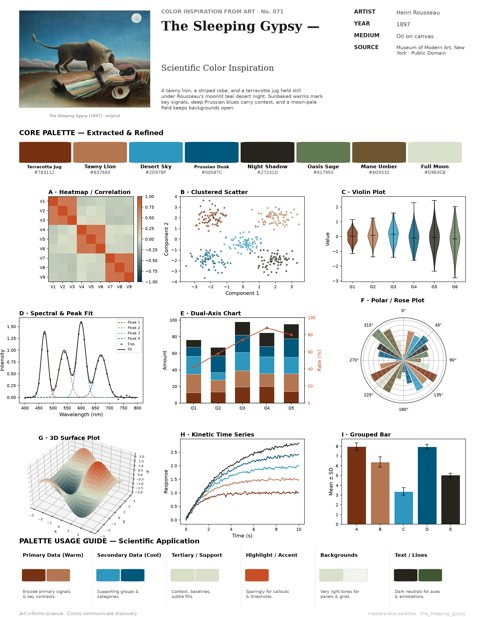</a><br><sub><b>The Sleeping Gypsy</b><br>Henri Rousseau, 1897</sub></td>
</tr>
</table>


### Modern (12)

<table>
<tr>
<td align="center" width="25%"><a href="posters/american_gothic.jpg">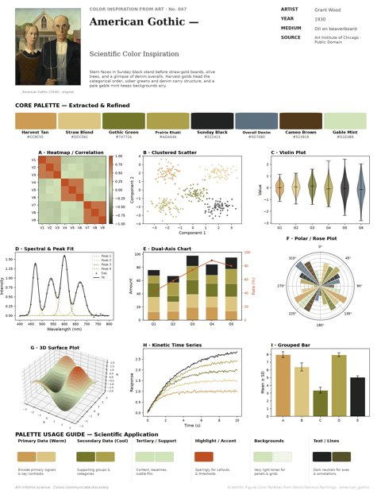</a><br><sub><b>American Gothic</b><br>Grant Wood, 1930</sub></td>
<td align="center" width="25%"><a href="posters/the_scream.jpg">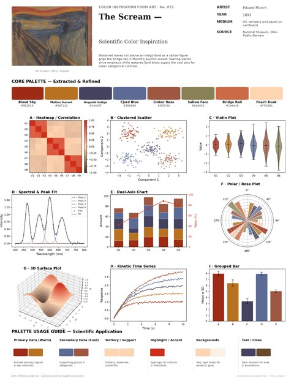</a><br><sub><b>The Scream</b><br>Edvard Munch, 1893</sub></td>
<td align="center" width="25%"><a href="posters/the_kiss_klimt.jpg">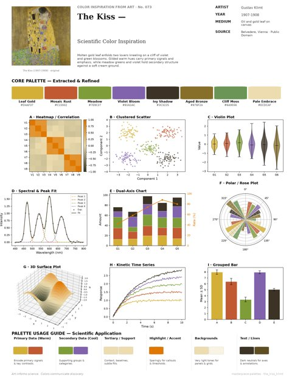</a><br><sub><b>The Kiss</b><br>Gustav Klimt, 1907-1908</sub></td>
<td align="center" width="25%"><a href="posters/adele_bloch_bauer.jpg">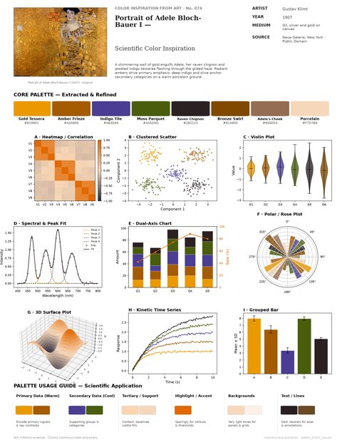</a><br><sub><b>Portrait of Adele Bloch-Bauer I</b><br>Gustav Klimt, 1907</sub></td>
</tr>
<tr>
<td align="center" width="25%"><a href="posters/four_trees.jpg">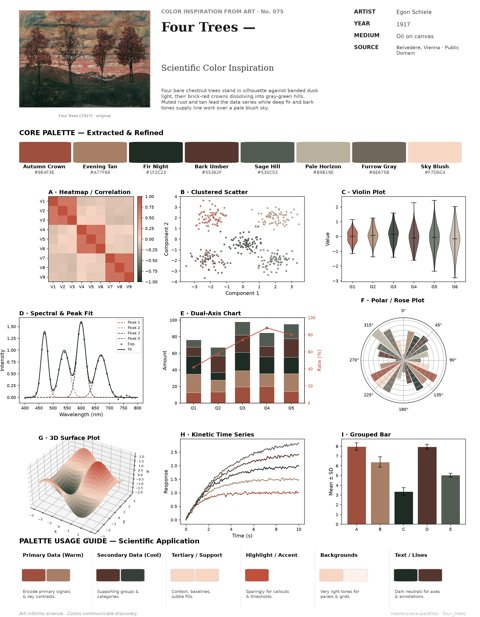</a><br><sub><b>Four Trees</b><br>Egon Schiele, 1917</sub></td>
<td align="center" width="25%"><a href="posters/jeanne_hebuterne.jpg">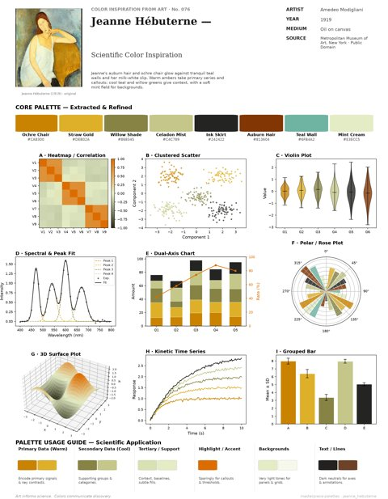</a><br><sub><b>Jeanne Hebuterne</b><br>Amedeo Modigliani, 1919</sub></td>
<td align="center" width="25%"><a href="posters/senecio.jpg">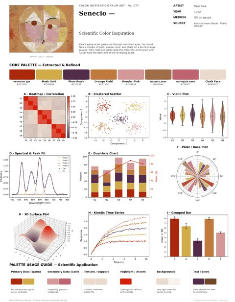</a><br><sub><b>Senecio</b><br>Paul Klee, 1922</sub></td>
<td align="center" width="25%"><a href="posters/composition_viii.jpg">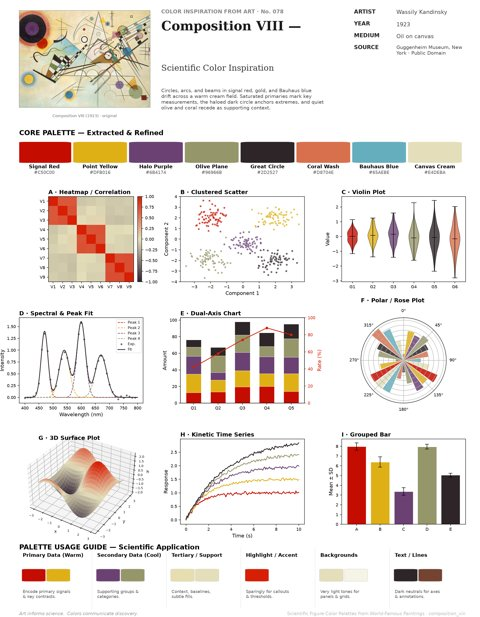</a><br><sub><b>Composition VIII</b><br>Wassily Kandinsky, 1923</sub></td>
</tr>
<tr>
<td align="center" width="25%"><a href="posters/composition_red_blue_yellow.jpg">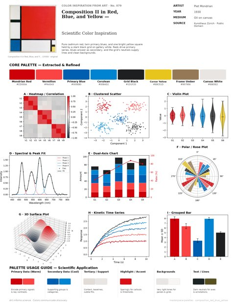</a><br><sub><b>Composition II in Red, Blue, and Yellow</b><br>Piet Mondrian, 1930</sub></td>
<td align="center" width="25%"><a href="posters/dance.jpg">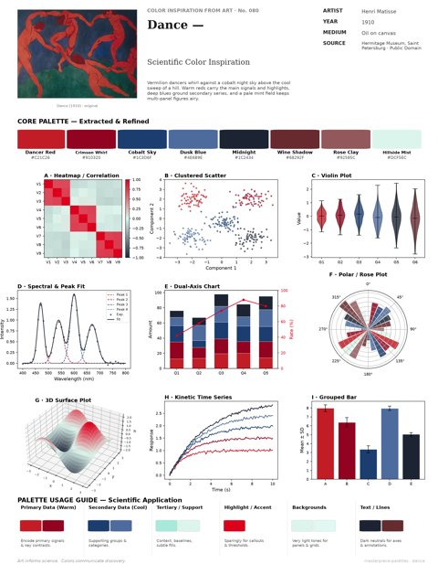</a><br><sub><b>Dance</b><br>Henri Matisse, 1910</sub></td>
<td align="center" width="25%"><a href="posters/goldfish.jpg">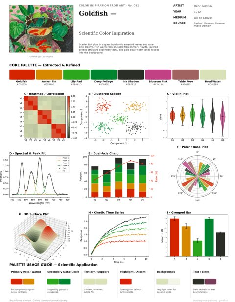</a><br><sub><b>Goldfish</b><br>Henri Matisse, 1912</sub></td>
<td align="center" width="25%"><a href="posters/large_blue_horses.jpg">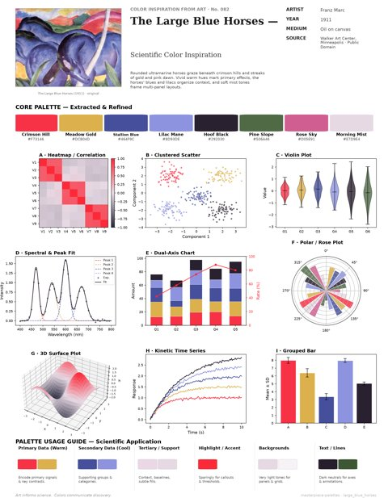</a><br><sub><b>The Large Blue Horses</b><br>Franz Marc, 1911</sub></td>
</tr>
</table>


### Japanese Ukiyo-e (10)

<table>
<tr>
<td align="center" width="25%"><a href="posters/great_wave.jpg">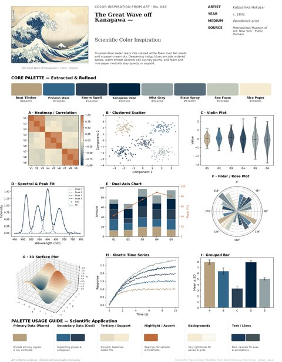</a><br><sub><b>The Great Wave off Kanagawa</b><br>Katsushika Hokusai, c. 1831</sub></td>
<td align="center" width="25%"><a href="posters/red_fuji.jpg">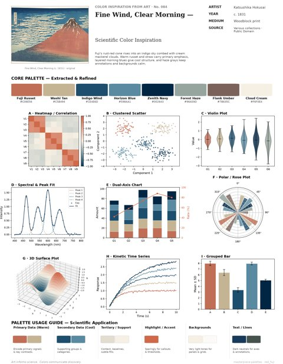</a><br><sub><b>Fine Wind, Clear Morning</b><br>Katsushika Hokusai, c. 1831</sub></td>
<td align="center" width="25%"><a href="posters/kirifuri_waterfall.jpg">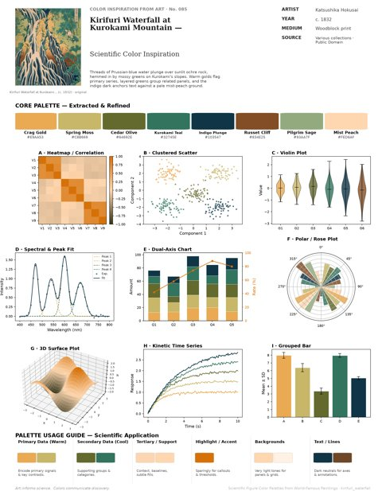</a><br><sub><b>Kirifuri Waterfall at Kurokami Mountain</b><br>Katsushika Hokusai, c. 1832</sub></td>
<td align="center" width="25%"><a href="posters/plum_park_in_kameido.jpg">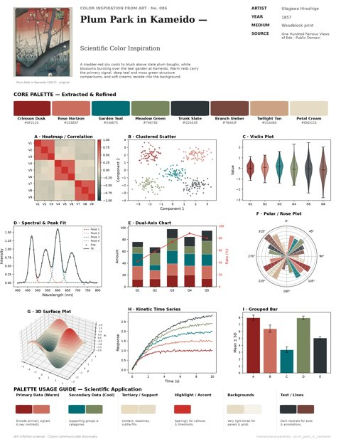</a><br><sub><b>Plum Park in Kameido</b><br>Utagawa Hiroshige, 1857</sub></td>
</tr>
<tr>
<td align="center" width="25%"><a href="posters/sudden_shower_over_shin_ohashi.jpg">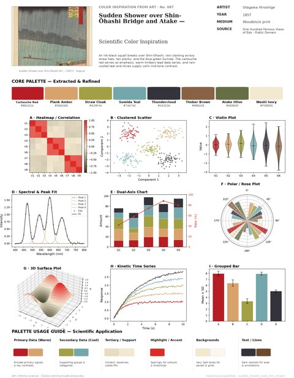</a><br><sub><b>Sudden Shower over Shin-Ohashi Bridge and Atake</b><br>Utagawa Hiroshige, 1857</sub></td>
<td align="center" width="25%"><a href="posters/naruto_whirlpools.jpg">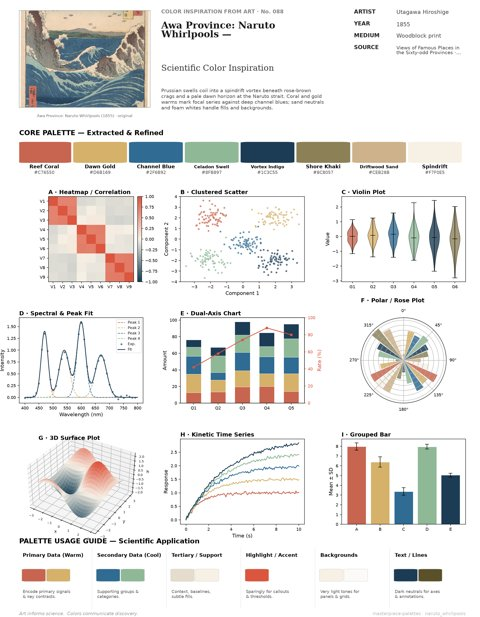</a><br><sub><b>Awa Province: Naruto Whirlpools</b><br>Utagawa Hiroshige, 1855</sub></td>
<td align="center" width="25%"><a href="posters/evening_snow_at_kanbara.jpg">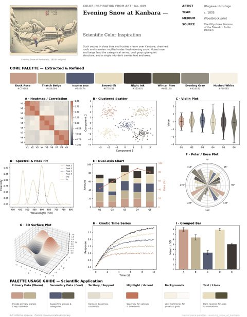</a><br><sub><b>Evening Snow at Kanbara</b><br>Utagawa Hiroshige, c. 1833</sub></td>
<td align="center" width="25%"><a href="posters/three_beauties.jpg">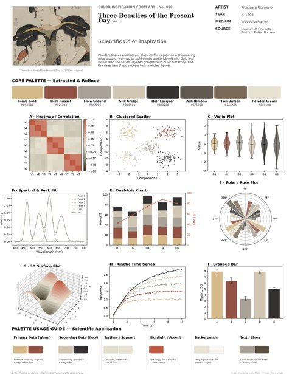</a><br><sub><b>Three Beauties of the Present Day</b><br>Kitagawa Utamaro, c. 1793</sub></td>
</tr>
<tr>
<td align="center" width="25%"><a href="posters/beauty_looking_back.jpg">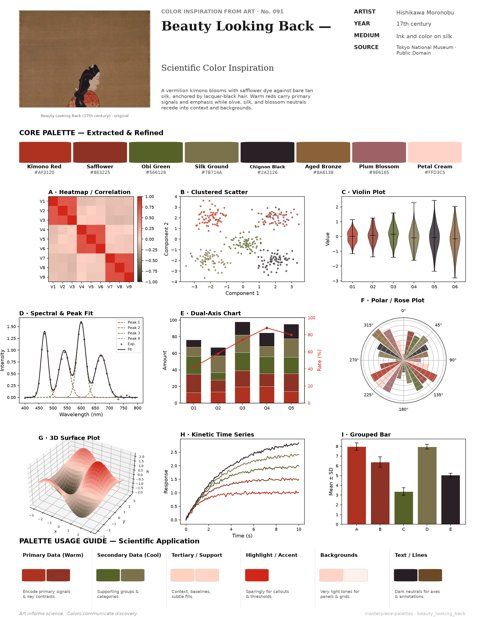</a><br><sub><b>Beauty Looking Back</b><br>Hishikawa Moronobu, 17th century</sub></td>
<td align="center" width="25%"><a href="posters/jakuchu_rooster.jpg">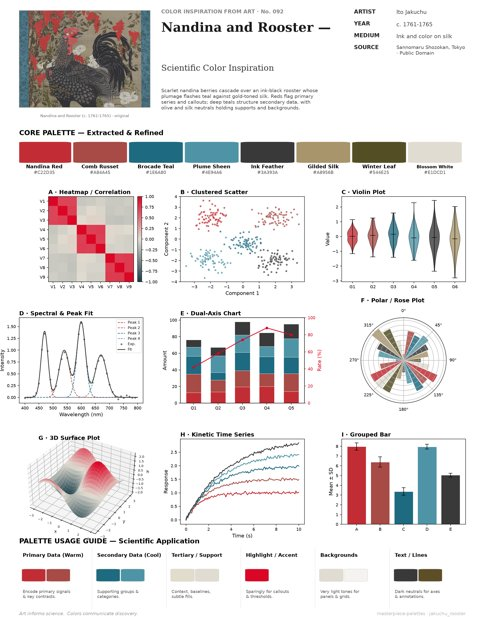</a><br><sub><b>Nandina and Rooster</b><br>Ito Jakuchu, c. 1761-1765</sub></td>
</tr>
</table>


### Chinese Classical (10)

<table>
<tr>
<td align="center" width="25%"><a href="posters/thousand_li_of_rivers_and_mountains.jpg">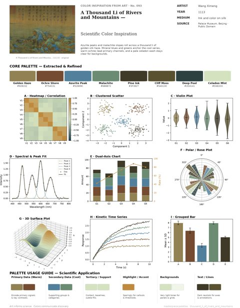</a><br><sub><b>A Thousand Li of Rivers and Mountains</b><br>Wang Ximeng, 1113</sub></td>
<td align="center" width="25%"><a href="posters/along_the_river_qingming.jpg">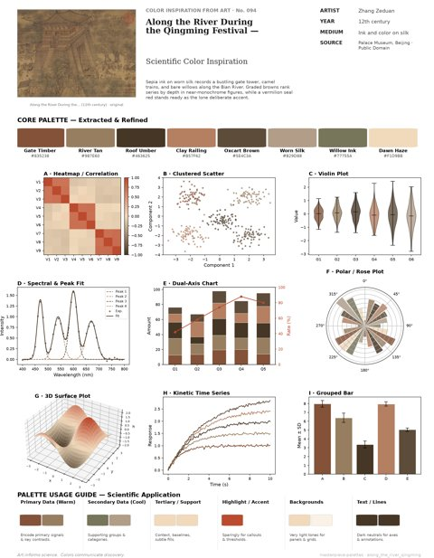</a><br><sub><b>Along the River During the Qingming Festival</b><br>Zhang Zeduan, 12th century</sub></td>
<td align="center" width="25%"><a href="posters/dwelling_in_the_fuchun_mountains.jpg">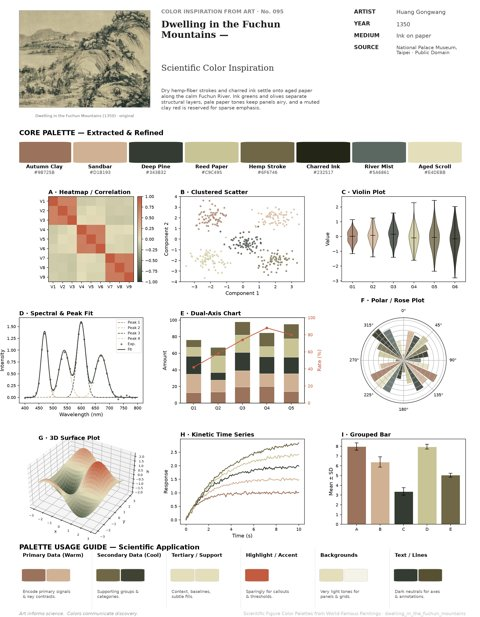</a><br><sub><b>Dwelling in the Fuchun Mountains</b><br>Huang Gongwang, 1350</sub></td>
<td align="center" width="25%"><a href="posters/nymph_of_the_luo_river.jpg">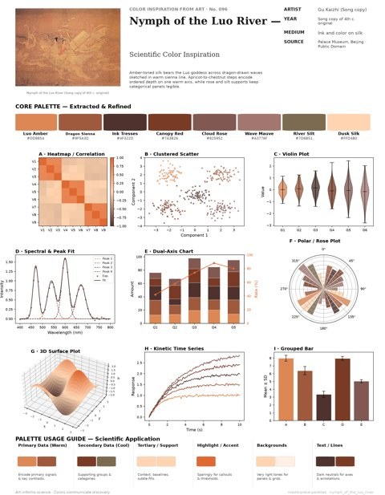</a><br><sub><b>Nymph of the Luo River</b><br>Gu Kaizhi (Song copy), Song copy of 4th c. original</sub></td>
</tr>
<tr>
<td align="center" width="25%"><a href="posters/night_revels_of_han_xizai.jpg">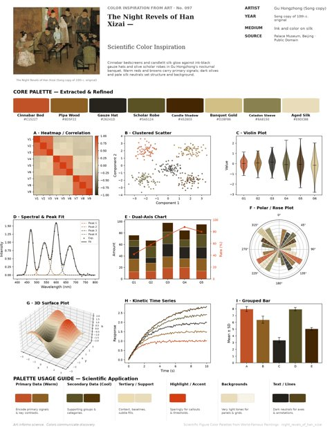</a><br><sub><b>The Night Revels of Han Xizai</b><br>Gu Hongzhong (Song copy), Song copy of 10th c. original</sub></td>
<td align="center" width="25%"><a href="posters/five_oxen.jpg">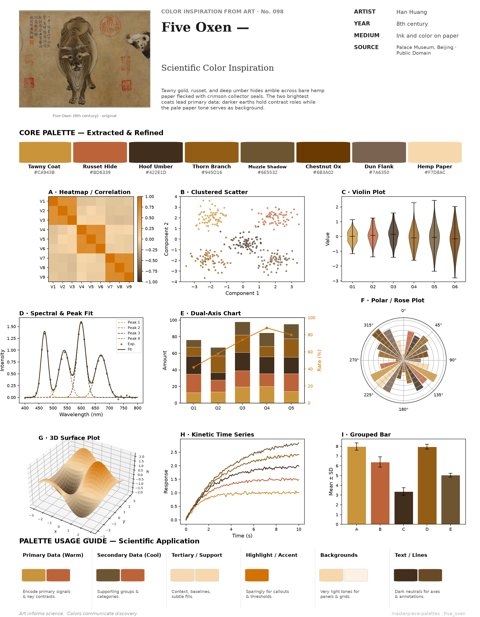</a><br><sub><b>Five Oxen</b><br>Han Huang, 8th century</sub></td>
<td align="center" width="25%"><a href="posters/bunian_tu.jpg">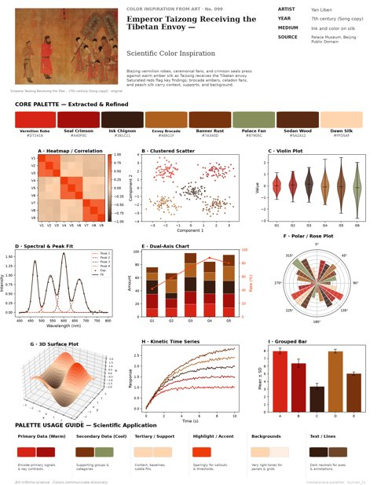</a><br><sub><b>Emperor Taizong Receiving the Tibetan Envoy</b><br>Yan Liben, 7th century (Song copy)</sub></td>
<td align="center" width="25%"><a href="posters/court_ladies_preparing_silk.jpg">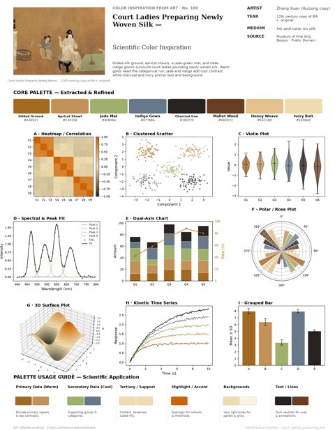</a><br><sub><b>Court Ladies Preparing Newly Woven Silk</b><br>Zhang Xuan (Huizong copy), 12th century copy of 8th c. original</sub></td>
</tr>
<tr>
<td align="center" width="25%"><a href="posters/court_ladies_adorning_with_flowers.jpg"></a><br><sub><b>Court Ladies Adorning Their Hair with Flowers</b><br>Zhou Fang, 8th century</sub></td>
<td align="center" width="25%"><a href="posters/one_hundred_horses.jpg">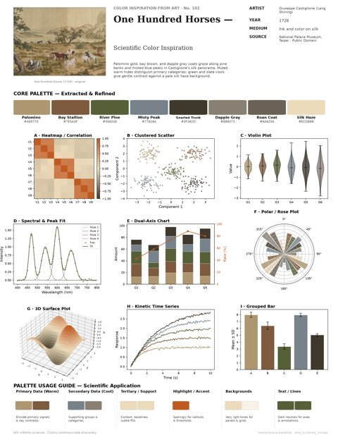</a><br><sub><b>One Hundred Horses</b><br>Giuseppe Castiglione (Lang Shining), 1728</sub></td>
</tr>
</table>


## Related projects

[MetBrewer](https://github.com/BlakeRMills/MetBrewer) and
[MoMAColors](https://github.com/BlakeRMills/MoMAColors) offer R palettes inspired by
museum collections. masterpiece-palettes differs in scope (102 named paintings with
posters demonstrating each palette on nine chart types), in its role-based usage
system, and in shipping as both Python API and plain JSON.

## License & attribution

- **Code** (engine + package): MIT.
- **Palette data**: CC0 — use freely, attribution appreciated.
- **Paintings**: all works are in the public domain (artists deceased 70+ years;
  works published before 1931). Faithful photographic reproductions of public-domain
  paintings are themselves public domain (*Bridgeman v. Corel*). Images sourced from
  Wikimedia Commons; each poster credits artist, year, and holding museum.

*Art informs science. Colors communicate discovery.*
